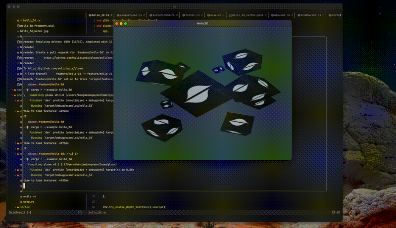
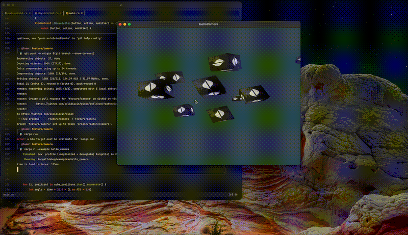

# GLoam

A work-in-progress OpenGL library for Rust built on top of [gl](https://docs.rs/gl/latest/gl/) and [glfw](https://docs.rs/glfw/latest/glfw/).

## FAQ

- Why are you doing this?
    - To learn OpenGL.
- Why are you learning such an ancient and outdated technology? Have you heard of [wgpu](https://wgpu.rs/)?
    - Yes and yes.
- Should I use this in production?
    - Only if it's for shits and giggles; otherwise, no.
- Are you trying to compete with [glium](https://github.com/glium/glium)?
    - No.
- Who is the Gloam-Eyed Queen?
    - We may never know.

## Demo

**FYI**: GIF quality is pretty bad and doesn't reflect how things actually look.

### [Hello Triangle](./examples/hello_triangle/main.rs)

### [Hello Textures](./examples/hello_textures/main.rs)

### [Hello 3D](./examples/hello_3d/main.rs)

### [Hello Camera](./examples/hello_camera/main.rs)

